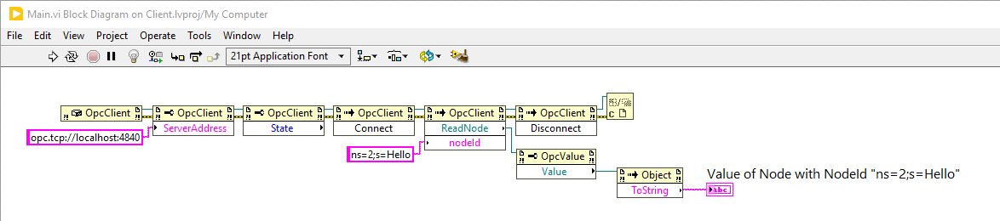
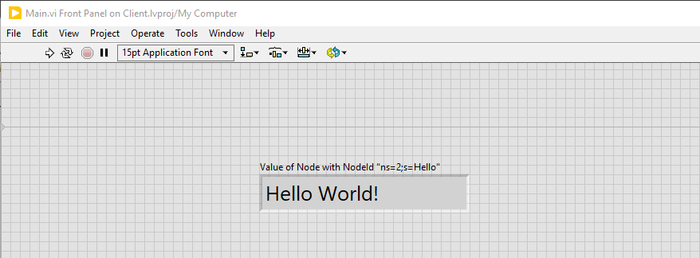

# Getting Started

1. Go to <https://docs.traeger.de/en/software/sdk/opc-ua/net>
2. Download the **OPC UA .NET SDK for LabVIEW Clients**
3. Unarchive the ZIP and copy the **net46** folder into your LabVIEW project directory
4. Consume the .NET Objects defined in the **Opc.UaFx.Client.LabView.dll** in LabVIEW

The following image shows the contents of the Block Diagram defined in this sample.

Running the Block Diagram defined by the sample the Front will display output like follows:

Please note that the **OPC UA .NET SDK for LabVIEW Clients** requires at least .NET Framework 4.6 however this means the SDK can only used in LabVIEW 2016 and later. To additionally verify whether your installed LabVIEW version supports .NET Framework 4.6 you can refer to the LabVIEW readme file available at your specific LabVIEW download page or, if LabVIEW is already installed, in folder ``C:\Program Files (x86)\National Instruments\LabVIEW xx\readme`` to check which .NET Framework is supported. This is typically indicated under ``System Requirements`` section.
